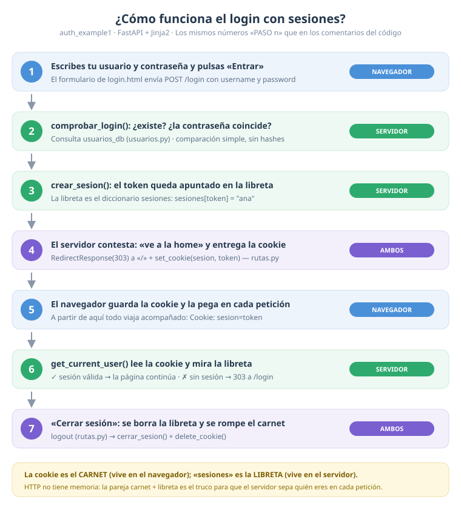

# Guía del estudiante — Login simple con FastAPI + Jinja2

Esta guía te acompaña por un proyecto pequeño pero completo: una web
**con login**. Al final entenderás cómo una página web sabe "quién
eres" entre una petición y otra.

---

## 1. ¿Qué vas a construir?

- Una **página de login** con formulario (usuario y contraseña).
- Una **home** con un menú que lleva a dos páginas privadas:
  **Mi perfil** y **Mis objetos**.
- **Todas las páginas están protegidas**: si intentas entrar sin haber
  hecho login, el servidor te manda al formulario automáticamente.

Usuarios de prueba: `ana / 1234` y `luis / abcd`.

### Cómo arrancarlo

```bash
uv sync        # solo la primera vez: instala las dependencias
fastapi dev    # arranca el servidor
```

Abre <http://127.0.0.1:8000>. Verás que aunque escribas la dirección
de la home (`/`), el navegador acaba en `/login`. ¡Eso es la protección
funcionando!

---

## 2. La idea clave: HTTP no tiene memoria

Cuando tu navegador pide una página, el servidor la sirve y **se
olvida de ti**. La siguiente petición llega "suelta": el servidor no
sabe que eres tú. A eso se debe que una web sin login no pueda
mostrarte "tus datos".

La solución clásica tiene dos piezas:

1. **La cookie** — un pequeño dato que el servidor entrega al
   navegador y que el navegador devuelve en *todas* las peticiones
   siguientes. Es como un **carnet**: el servidor lo lee en cada
   petición.
2. **La libreta de sesiones** — el servidor apunta qué carnet
   pertenece a cada usuario. Aquí es el diccionario `sesiones` de
   `seguridad.py`: `{token: username}`. Además se guarda en disco
   (`sesiones.json`), así que **sobrevive a los reinicios**.

El mismo recorrido, en dibujo (`diagrama-login.svg`, imprímelo si
quieres tenerlo al lado):



Los comentarios del código usan esos mismos números **PASO 1 a PASO 7**:
código, guía y diagrama cuentan la misma historia. Si te pierdes,
sigue los números.

El flujo completo, con nombres de este proyecto:

```
Navegador                          Servidor (FastAPI)
   |                                       |
   |--- PASO 1-2: POST /login, ana/1234 ->|  comprobar_login() ✓
   |<-- PASO 3-4: 303 a "/" + Set-Cookie -|  crear_sesion(): sesiones[token] = "ana"
   |                                       |
   |--- PASO 5-6: GET / (Cookie: token) ->|  get_current_user() lee la cookie,
   |<-- home.html ("Hola, Ana") ----------|  busca en `sesiones` → "ana" ✓
```

Cuando pulsan **Cerrar sesión**: se borra la línea de la libreta
(`cerrar_sesion`) y se borra la cookie del navegador
(`delete_cookie`). Sin carnet, no hay acceso.

---

## 3. Mapa del proyecto: quién hace qué

```
main.py        → ENCAMBIA la aplicación (muy pocas líneas)
rutas.py       → las PÁGINAS: cada función es una URL
seguridad.py   → QUIÉN está conectado (sesiones, cookies, protección)
usuarios.py    → los DATOS (usuarios, contraseñas, objetos)
templates/     → el ASPECTO (HTML que se rellena con datos)
diagrama-login.svg → el RECORRIDO del login en dibujo (PASO 1 a 7)
```

Cada archivo hace **una sola cosa**. Eso se llama *separación de
responsabilidades*: cuando buscas un error, ya sabes en qué archivo
mirar.

### ¿Qué hace cada archivo?

| Archivo | Responsabilidad | Idea de una línea |
|---|---|---|
| `main.py` | montar la app | "crea FastAPI y añade las rutas" |
| `rutas.py` | rutas/páginas | "cada función es una página" |
| `seguridad.py` | sesiones | "crea, comprueba y borra sesiones" |
| `usuarios.py` | datos | "quién existe y qué tiene" |
| `templates/*.html` | HTML | "el esqueleto + los huecos a rellenar" |

---

## 3. Tour por el código (léelo en este orden)

> **Consejo:** los comentarios llevan marcas **«PASO n»** que enlazan con
> el diagrama y con la sección 2. Cuando leas un PASO, vuelve al dibujo
> y verás dónde encaja cada pieza.

### 3.1 `usuarios.py` — los datos

- `Usuario` es un **modelo Pydantic**: convierte un diccionario en un
  objeto con campos con nombre (`username`, `nombre_completo`, `email`).
- `usuarios_db` es la "base de datos": un diccionario. **OJO: la
  contraseña se guarda tal cual.** Es a propósito para simplificar la
  lección; en la vida real se guarda un *hash*.
- `buscar_usuario(username)` devuelve un `Usuario` o `None`.

### 3.2 `seguridad.py` — sesiones y protección

- `COOKIE_SESION = "sesion"` — el nombre de la cookie (el "carnet").
- `sesiones` — la libreta: `{token: username}`. Se guarda en el disco
  (`sesiones.json`), así que **sobrevive a los reinicios** del servidor.
- `crear_sesion()` — genera un token aleatorio con `secrets.token_hex(16)`,
  lo guarda en la libreta y la vuelca al disco (`guardar_sesiones()`).
- `comprobar_login()` — mira si el usuario existe y la contraseña
  coincide (una simple comparación de texto). **PASO 2** del diagrama.
- `get_current_user()` — ⭐ **la dependencia que protege las rutas**
  (**PASO 6**: se ejecuta en cada página privada). Lee la cookie, busca en la libreta y: si hay sesión devuelve el
  `Usuario`; si no, **responde con una redirección (303) hacia /login**.
- `UsuarioDep` — un apodo (`Annotated[Usuario, Depends(get_current_user)]`)
  para pedir el usuario conectado en una ruta escribiendo solo
  `usuario: UsuarioDep`.

### 3.3 `rutas.py` — las páginas

| Ruta | Método | ¿Protegida? | Qué hace |
|---|---|---|---|
| `/login` | GET | no | muestra el formulario |
| `/login` | POST | no | comprueba credenciales, crea sesión y cookie |
| `/logout` | GET | no | borra sesión y cookie, redirige al login |
| `/` | GET | **sí** | home con menú |
| `/perfil` | GET | **sí** | datos del usuario conectado |
| `/objetos` | GET | **sí** | lista de objetos del usuario |

¿Por qué `/login` no está protegida? Piénsalo... si exigiera sesión
para entrar, ¡nadie podría iniciar sesión nunca! Es la única puerta.

Fíjate en el patrón de las rutas privadas:

```python
@router.get("/perfil")
def perfil(request: Request, usuario: UsuarioDep):
```

Ese parámetro `usuario: UsuarioDep` **hace dos cosas a la vez**:
protege la ruta (redirige si no hay sesión) y te da los datos del
usuario dentro de la función.

### 3.4 `templates/` — el aspecto

- **`base.html`** es la plantilla madre: estructura, estilos y el
  menú. Las demás "extienden" (``) y solo
  rellenan su bloque ``.
- Jinja2 usa tres sintaxis: `{{ variable }}` (imprime),
  `...` (condicional), `...`
  (bucle). Los comentarios de plantilla van entre `{# #}`.
- El menú solo se pinta si existe `usuario`:
  `...`.

### 3.5 `main.py` — el encambio

Crea `app = FastAPI(...)` y hace `app.include_router(router)`. Nada más.

---

## 4. Pruébalo como lo haría un usuario

1. `fastapi dev` y abre <http://127.0.0.1:8000/perfil> → te manda al login.
2. Pon `ana` / `1234` → entras y en el menú aparece "Hola, Ana García".
3. Entra en **Mi perfil** y en **Mis objetos** (verás la lista de ana).
4. Haz login ahora con `luis / abcd` → verás **otros** objetos. Cada
   usuario solo ve los suyos.
5. Pulsa **Cerrar sesión** y prueba a volver a `/perfil` → otra vez al login.
6. En el login, equivócate a propósito de la contraseña → vuelve a
   aparecer el formulario con el mensaje de error.
7. **Prueba la persistencia** (¡lo nuevo!): cierra el navegador y
   vuelve a la web → sigues dentro (la cookie vive 7 días). Ahora
   para el servidor (`Ctrl+C`), arráncalo de nuevo y recarga →
   ¡sigues dentro también! La libreta se leyó de `sesiones.json`.
   Bórralo con el servidor parado y tendrás que repetir el login.

**Para ver las cookies** en el navegador: F12 → pestaña
*Application/Almacenamiento* → *Cookies*. Tras el login verás `sesion`
con su token aleatorio. Bórrala y recarga: volverás al login.

**Para ver la API automática**: <http://127.0.0.1:8000/docs>.

---

## 5. Conceptos nuevos que aparecen (glosario rápido)

- **Ruta**: una dirección (`/perfil`) con su función que responde.
- **GET / POST**: pedir una página vs. enviar datos de un formulario.
- **Plantilla (template)**: HTML con huecos (`{{ }}`, ``) que
  Jinja2 rellena con datos del servidor.
- **Dependencia** (`Depends`): función que FastAPI ejecuta antes de
  tu ruta; aquí decide si dejas pasar o mandas al login.
- **Cookie**: dato pequeño que el navegador devuelve en cada petición.
  Con `max_age` tiene fecha de caducidad y sobrevive al cierre.
- **Sesión**: la pareja {token → usuario} que guarda el servidor.
- **Código 303**: "ve a otra página" (redirección); el navegador
  sigue la cabecera `Location` sin que el usuario haga nada.

---

## 6. Ejercicios (de menor a mayor dificultad)

1. **Saludo personalizado**: en `home.html`, añade debajo del
   saludo una línea con el email del usuario (`usuario.email`).
2. **Cuéntamelo en la home**: en `home.html`, muestra cuántos objetos
   tiene el usuario (`objetos|length` necesita pasar la lista desde
   la ruta; fíjate en cómo lo hace `objetos()`).
3. **Nueva página privada**: crea `/saludos` que muestre
   "¡Buenos días, *nombre*!" solo con sesión. Necesitas: una función
   en `rutas.py` con `usuario: UsuarioDep` y una plantilla nueva.
   Añade el enlace en el menú (`base.html`).
4. **Contador de visitas**: guarda en un diccionario (en `seguridad.py`
   o en una variable de `rutas.py`) cuántas veces ha entrado cada
   usuario en la home y muéstralo en `home.html`.
5. **Página de error bonita**: crea `templates/error.html` y úsala en
   `enviar_login` cuando las credenciales fallan, en lugar de repetir
   el formulario.
6. **(Reto) Explora la libreta**: haz login y abre `sesiones.json`:
   encuentra tu token (compáralo con la cookie de las DevTools).
   Con el servidor parado, cambia a mano el `username` de tu token
   por el del otro usuario, arranca de nuevo y recarga. ¿Qué ha
   pasado? ¿Por qué? Explica en una frase: *quien tiene tu token,
   es tú*. Esa es la razón de que `secrets.token_hex` genere
   códigos imposibles de adivinar.

> Comprueba siempre: sin sesión, ¿me manda al login? Con sesión,
> ¿ve solo SUS datos?

---

## 7. Siguiente paso (cuando domines esto)

Este proyecto simplifica a propósito. Cuando quieras dar el salto a
algo real, la documentación oficial te espera con las tres piezas que
aquí faltan:

- Hash de contraseñas (nunca texto plano).
- Sesiones firmadas o tokens JWT en vez de la libreta JSON.
- Base de datos real en lugar de diccionarios.

Pero una cosa cada vez: primero entiende **bien** este ejemplo. 💪